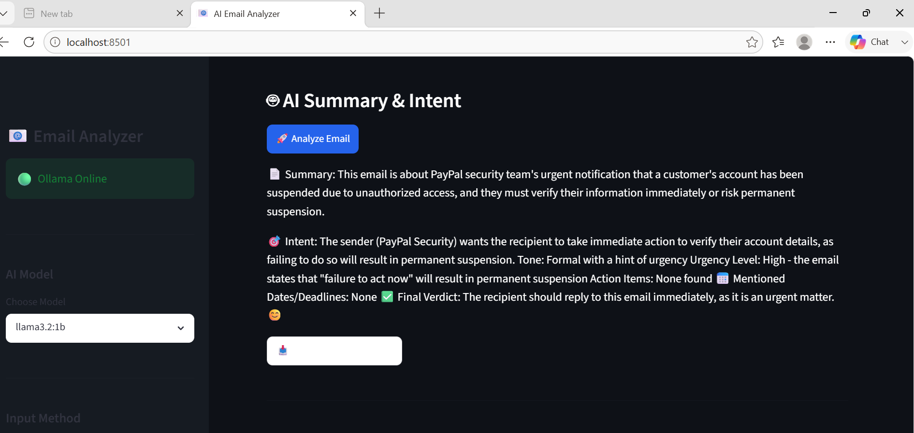

<div align="center">

# 📧 AI Email Analyzer

### 🤖 Analyze, Summarize, Detect Spam & Generate Smart Replies using Local AI (Ollama + Streamlit)


### ⭐ Analyze Emails Faster, Smarter & Privately with AI

**An AI-powered Email Analyzer built with Python, Streamlit, and Ollama that summarizes emails, detects spam and phishing risks, extracts important information, identifies action items, analyzes sentiment, and generates intelligent replies — all while keeping your data completely private on your own computer.**

⭐ **If you like this project, don't forget to Star the Repository!**

</div>

---

# 📌 Project Overview

AI Email Analyzer is an intelligent AI-powered web application developed using **Python**, **Streamlit**, and **Ollama**.

The application allows users to upload **.EML** email files or paste raw email content, automatically extract important information, and use a **Local Large Language Model (LLM)** to analyze the email.

Instead of manually reading lengthy emails, users receive an instant AI-powered summary, spam and phishing analysis, sentiment detection, priority prediction, action items, meeting details, and even a ready-to-send AI-generated reply.

Unlike cloud-based AI applications, this project runs **100% locally** using Ollama, ensuring complete privacy and security because your emails never leave your computer.

---

# ✨ Features

| Feature | Description |
|----------|-------------|
| 📧 Email Upload | Upload `.eml` email files |
| 📝 Paste Email | Paste raw email content directly |
| 📖 Email Parsing | Automatically extract sender, receiver, subject, date, body, links and attachments |
| 🤖 AI Summary | Generate a concise summary of the email |
| 🚫 Spam Detection | Detect spam emails using AI |
| 🛡️ Phishing Risk Analysis | Identify suspicious emails and phishing attempts |
| ⭐ Priority Prediction | Classify emails as High, Medium or Low priority |
| 😊 Sentiment Analysis | Detect Positive, Neutral or Negative emotions |
| 🎯 Intent Detection | Understand the purpose of the email |
| 📅 Meeting Detection | Extract meeting dates and times |
| ⏰ Deadline Detection | Identify important deadlines |
| ✅ Action Items | Detect tasks that require attention |
| 🔑 Keyword Extraction | Extract important keywords |
| ✍️ AI Reply Generator | Generate professional AI replies |
| 🧵 Thread Summary | Summarize long email conversations |
| 💬 Ask AI | Ask questions about the uploaded email |
| 📊 Email Statistics | View word count, links and attachments |
| 📥 Download Report | Export AI analysis as a text report |
| 🌙 Modern UI | Beautiful dark-themed Streamlit interface |
| 🔒 Privacy First | Everything runs locally using Ollama |

---

# 🚀 Why This Project?

Reading long emails takes time.

Finding important information inside emails is even harder.

AI Email Analyzer automatically understands your emails within seconds and highlights everything important so you can focus on what matters.

It helps users to:

- 📄 Understand lengthy emails instantly
- 🛡️ Detect suspicious or phishing emails
- ⏰ Never miss deadlines
- 📅 Find meetings automatically
- 📌 Track action items
- 😊 Understand the sender's emotions
- ✍️ Reply professionally using AI
- 🔒 Keep all email data private

---

# 🖥️ Application Preview

<div align="center">

| Home Page | Upload Email |
|:----------:|:------------:|
|  |  |

| AI Summary | Spam Detection |
|:----------:|:--------------:|
|  |  |

| AI Reply Generator |
|:------------------:|
|  |

</div>

> **Note:** Replace these screenshots with your own application screenshots stored inside the **screenshots/** folder.

---

# 🚀 How It Works

```text
             Upload Email
                  │
                  ▼
      Parse Email Headers & Body
                  │
                  ▼
     Extract Links & Attachments
                  │
                  ▼
     Spam & Phishing Detection
                  │
                  ▼
      Send Prompt to Ollama AI
                  │
                  ▼
        AI Understands Email
                  │
                  ▼
     Generate Complete Analysis
                  │
                  ▼
 ┌──────────────────────────────────────┐
 │ • Summary                            │
 │ • Sentiment                          │
 │ • Priority                           │
 │ • Keywords                           │
 │ • Action Items                       │
 │ • Meeting Dates                      │
 │ • Reply Generation                   │
 └──────────────────────────────────────┘
                  │
                  ▼
        Download AI Report
```

---

# 🧠 AI Capabilities

The AI model can intelligently perform the following tasks:

### 📄 Email Understanding

- Email Summarization
- Intent Detection
- Context Understanding
- Thread Summarization

### 🛡️ Security Analysis

- Spam Detection
- Phishing Detection
- Suspicious Link Analysis
- Risk Score Prediction

### 📈 Smart Analysis

- Priority Classification
- Sentiment Analysis
- Emotion Detection
- Keyword Extraction
- Important Information Detection

### 📅 Productivity

- Meeting Date Extraction
- Deadline Detection
- Action Item Identification
- Task Recognition

### ✍️ AI Assistance

- Professional Reply Generation
- Friendly Reply Generation
- Formal Reply Generation
- Question Answering

---

# 📂 Project Structure

```text
AI-Email-Analyzer/
│
├── assets/
│   └── email_analyzer_banner.svg
│
├── screenshots/
│   ├── homepage.png
│   ├── upload.png
│   ├── summary.png
│   ├── risk_check.png
│   └── reply_draft.png---

# ⚙️ Installation

Follow these steps to set up the project on your local machine.

## 1️⃣ Clone the Repository

```bash
git clone https://github.com/YourUsername/AI-Email-Analyzer.git
cd AI-Email-Analyzer
```

---

## 2️⃣ Create a Virtual Environment

### Windows

```bash
python -m venv .venv
.venv\Scripts\activate
```

### Linux / macOS

```bash
python3 -m venv .venv
source .venv/bin/activate
```

---

## 3️⃣ Install Dependencies

Install all required Python packages.

```bash
pip install -r requirements.txt
```

---

# 🦙 Install Ollama

This project uses **Ollama** to run Large Language Models (LLMs) locally.

Download Ollama from:

https://ollama.com/download

Verify the installation:

```bash
ollama --version
```

---

# 📥 Download an AI Model

Pull your preferred AI model.

Recommended:

```bash
ollama pull llama3.2:1b
```

Other supported models:

- llama3.2
- llama3.1
- mistral
- gemma
- phi3

---

# ▶️ Start Ollama

Before launching the application, start the Ollama server.

```bash
ollama serve
```

When Ollama is running successfully, the application sidebar will display:

```
🟢 Ollama Online
```

---

# 🚀 Run the Application

Start the Streamlit application.

```bash
streamlit run app.py
```

The application will automatically open in your browser.

```
http://localhost:8501
```

---

# 📋 Supported Input Types

| Input | Supported |
|--------|-----------|
| Upload .EML Email | ✅ |
| Paste Raw Email Text | ✅ |
| Outlook (.MSG) | ❌ |
| Gmail Export (.EML) | ✅ |
| Thunderbird Emails | ✅ |

---

# 💡 Example Workflow

### Step 1

Upload an **.EML** file or paste email text.

⬇

### Step 2

The application extracts:

- Sender
- Receiver
- Subject
- Date
- Email Body
- Links
- Attachments

⬇

### Step 3

AI performs:

- Spam Detection
- Phishing Analysis
- Priority Prediction
- Sentiment Analysis

⬇

### Step 4

Click

```
🚀 Analyze Email
```

⬇

### Step 5

Receive

- 📄 Email Summary
- 🎯 Intent
- ⭐ Priority
- 😊 Sentiment
- 📅 Meeting Dates
- ⏰ Deadlines
- ✅ Action Items
- 🔑 Keywords

⬇

### Step 6

Generate an AI reply.

Choose your preferred tone:

- Professional
- Friendly
- Formal
- Short
- Detailed

⬇

### Step 7

Download the complete AI report.

---

# 💻 Technologies Used

| Technology | Purpose |
|------------|---------|
| Python | Backend Development |
| Streamlit | User Interface |
| Ollama | Local AI Model |
| Requests | API Communication |
| email (Python Library) | Email Parsing |
| Regular Expressions (re) | Spam & Phishing Detection |
| Markdown | AI Report Generation |

---

# 📦 Python Modules

```text
streamlit
requests
```

Install everything using

```bash
pip install -r requirements.txt
```

---

# 📊 Email Analysis Report

After analysis, the application generates a comprehensive report including:

- 📄 Email Summary
- 🎯 Intent
- 😊 Sentiment
- ⭐ Priority Level
- 🚫 Spam Detection
- 🛡️ Phishing Risk Score
- 🔑 Keywords
- 📅 Meeting Information
- ⏰ Deadlines
- ✅ Action Items
- ✍️ AI Reply Draft

The report can be downloaded for future reference.

---

# 🔥 Key Highlights

✅ 100% Offline AI

✅ Privacy Friendly

✅ No Cloud APIs Required

✅ Local LLM using Ollama

✅ Beautiful Streamlit Dashboard

✅ AI Reply Generator

✅ Spam Detection

✅ Phishing Detection

✅ Priority Prediction

✅ Meeting Detection

✅ Deadline Extraction

✅ Sentiment Analysis

✅ Thread Summarization

✅ Downloadable Reports

✅ Fast Performance

✅ Easy to Use

---

# 🎯 Use Cases

This project is useful for:

- 📧 Personal Email Management
- 💼 Business Communication
- 🏢 Office Productivity
- 👨‍💻 Customer Support
- 📚 Educational Institutions
- 👨‍🎓 Students
- 👩‍💼 HR Departments
- 📈 Business Professionals
- 🛡️ Cybersecurity Awareness
- 📊 Email Organization

---

---

# 🔮 Future Improvements

The following features are planned for future releases:

- 🌍 Multi-language Email Analysis
- 📎 AI Analysis of Email Attachments (PDF, DOCX, TXT)
- 🖼 OCR Support for Image-based Emails
- 📊 Email Analytics Dashboard
- 📥 Gmail Integration
- 📧 Outlook Integration
- ☁ Cloud Deployment (Render, Streamlit Cloud, Hugging Face)
- 👥 User Authentication & Profiles
- 💾 Email History Storage
- 🔍 Bulk Email Analysis
- 📱 Mobile Responsive Interface
- 🎙 Voice-based Email Reading
- 🤖 Multiple AI Model Support
- 📌 Email Categorization
- 📈 AI-powered Productivity Insights

---

# ❓ Frequently Asked Questions (FAQ)

<details>
<summary><strong>Does this application send my emails to the internet?</strong></summary>

No.

All AI processing is performed locally using **Ollama** on your own computer.

Your emails are never uploaded to external servers.

</details>

---

<details>
<summary><strong>Does this require an internet connection?</strong></summary>

Only for the initial installation of Ollama and downloading the AI model.

Once installed, the application works completely offline.

</details>

---

<details>
<summary><strong>Can I use different AI models?</strong></summary>

Yes.

Supported models include:

- llama3.2
- llama3.1
- mistral
- gemma
- phi3

Any model supported by Ollama can be used.

</details>

---

<details>
<summary><strong>Does it support Outlook (.msg) files?</strong></summary>

Not directly.

Please export Outlook emails as **.eml** files before uploading them.

</details>

---

<details>
<summary><strong>How accurate is the spam and phishing detector?</strong></summary>

The application combines rule-based checks with AI analysis.

Although it provides highly useful insights, users should always verify suspicious emails before taking action.

</details>

---

# 🤝 Contributing

Contributions are welcome!

If you'd like to improve this project:

### 1. Fork the repository

### 2. Create a new branch

```bash
git checkout -b feature-name
```

### 3. Commit your changes

```bash
git commit -m "Add new feature"
```

### 4. Push your branch

```bash
git push origin feature-name
```

### 5. Open a Pull Request

Your contributions are greatly appreciated.

---

# 🐞 Report Issues

Found a bug?

Have an idea for a new feature?

Please open an Issue on GitHub describing the problem or suggestion.

Your feedback helps make this project even better.

---

# 📄 License

This project is licensed under the **MIT License**.

You are free to:

- ✅ Use
- ✅ Modify
- ✅ Share
- ✅ Distribute

for educational and personal projects.

Please refer to the **LICENSE** file for more information.

---

# 👩‍💻 Author

## **Hadia Amjad**

🎓 BS Artificial Intelligence Student

🏫 Pak-Austria Fachhochschule Institute of Applied Sciences and Technology (PAF-IAST)

📍 Haripur, Pakistan

---


# 💖 Support This Project

If you found this project useful,

please consider giving it a ⭐ on GitHub.

Your support motivates me to build more AI and Machine Learning projects.

---

# 🙏 Acknowledgements

Special thanks to the amazing open-source community and the developers of:

- Python
- Streamlit
- Ollama
- Requests

Their incredible work made this project possible.

---

# ⭐ Show Your Support

If you like this repository:

⭐ Star this repository

🍴 Fork this project

🐞 Report bugs

💡 Suggest new features

📢 Share it with others

Every contribution helps this project grow.

---

<div align="center">

# 📧 AI Email Analyzer

### Built with ❤️ using Python, Streamlit & Ollama

⭐ **If you like this project, don't forget to Star the Repository!**

---

### Thank you for visiting this repository!

Happy Coding! 🚀

© 2026 Hadia Amjad. All Rights Reserved.

</div>


